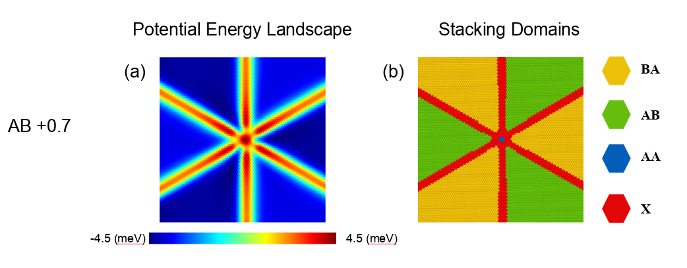

# Stacking Analysis

> A high-performance tool for analyzing atomic stacking configurations in bilayer materials. This repository contains the stacking analysis code used in:

Aditya, A. et al., 
“Emerging Ferroelectric Domains: Stacking and Rotational Landscape of MoS₂ Moiré Bilayers,”
ACS Nano (2026). Accepted; in press.


[](https://opensource.org/licenses/MIT)
[](https://www.python.org/downloads/)

## Overview

**Stacking Analysis** is a computational tool designed for identifying and classifying atomic stacking configurations in bilayer transition metal dichalcogenides (TMDs) and similar layered materials. It uses spatial partitioning and parallel processing to efficiently analyze large-scale atomic structures from LAMMPS molecular dynamics simulations.

The tool was developed for analyzing moiré TMD bilayers simulated using classical MD with hybrid Stillinger-Weber and Kolmogorov-Crespi potentials, following the methodology established in the published papers.

### Key Features

- 🚀 **High Performance**: Parallel processing with automatic CPU core detection
- 🎯 **Accurate Classification**: Identifies 6 distinct stacking types (AA, AA', A'B, AB, AB', BA)
- 📊 **Comprehensive Output**: Detailed statistics and labeled atomic structures
- 🔧 **Flexible Configuration**: Customizable parameters for different material systems
- 💻 **Easy to Use**: Simple command-line interface and Python API
- 📁 **LAMMPS Integration**: Direct support for LAMMPS dump files

## Citation

If you use this software in your research, please cite our paper:

```bibtex
@article{doi:10.1021/acsnano.5c14092,
author = {Aditya, Anikeya and Irie, Ayu and Dasgupta, Nabankur and Kalia, Rajiv K. and Nakano, Aiichiro and Vashishta, Priya},
title = {Emerging Ferroelectric Domains: Stacking and Rotational Landscape of MoS2 Moiré Bilayers},
journal = {ACS Nano},
volume = {0},
number = {0},
pages = {null},
year = {0},
doi = {10.1021/acsnano.5c14092},
    note ={PMID: 41648955},

URL = { 
    
        https://doi.org/10.1021/acsnano.5c14092
    
},
eprint = { 
    
        https://doi.org/10.1021/acsnano.5c14092
    
}

}
```

**Paper**: [\[Link to published paper\]  ](https://doi.org/10.1021/acsnano.5c14092)
**DOI**: `10.1021/acsnano.5c14092`

## Methodology

### Potential Energy Landscape and Stacking Domains

The classification algorithm identifies stacking configurations based on local atomic coordination patterns. The accuracy of the classification has been validated against both visual inspection and potential energy landscape calculations.



**Figure**: (a) Potential energy landscape showing energy variation with stacking configuration. High-energy regions (red/yellow, +4.5 meV) correspond to unfavorable stackings (AA, X), while low-energy regions (blue, -4.5 meV) correspond to stable AB stacking. (b) Classified stacking domains showing the correlation between energy landscape and identified stacking types. The classification accurately captures domain boundaries at energy transition regions.

### Force Field and Atom Type Numbering

This tool is designed for bilayer TMD systems simulated with **hybrid Stillinger-Weber (SW) and Kolmogorov-Crespi (KC) potentials**, following the standard approach for moiré TMD bilayers in classical MD:

- **Stillinger-Weber**: Governs intra-layer interactions within each MoS₂ monolayer
- **Kolmogorov-Crespi**: Governs inter-layer interactions between the two layers

**Atom Type Convention:**

In LAMMPS, atom types are numbered 1-6 even though the system contains only Mo and S atoms. This is **required** by the hybrid SW/KC force field implementation:

```
Layer 1 (Bottom):  Type 1 (Mo), Type 2 (S-bottom), Type 3 (S-top)
Layer 2 (Top):     Type 4 (Mo), Type 5 (S-bottom), Type 6 (S-bop)
```

Each layer's atoms must have distinct type numbers for the force field to correctly apply intra-layer (SW) and inter-layer (KC) interactions. This convention follows the **TWISTER paper** and is standard practice for investigating moiré TMD bilayers using these force fields.

**Analysis Target:** By default, the code analyzes **Type 4** atoms (top layer Mo), as these best represent the stacking configuration between layers. More detailed description is in the paper mentioned above.

### Parameter Selection

#### Distance Tolerance (r_tol = 0.614 Å)

The distance tolerance `r_tol = 0.614 Å` was carefully chosen through validation against both:
1. **Visual inspection** of stacking domain boundaries
2. **Potential energy landscape** calculations

This value provides optimal discrimination between stacking types while accurately capturing domain boundaries at energy transition regions (see figure above). The correlation between classified domains and energy landscape confirms that this tolerance correctly identifies the local coordination environment.

#### Voxel Size (150 Å)

The spatial partition size of `150 Å` was determined through systematic grid search optimization, balancing:

1. **Computational efficiency**: Large enough for effective NumPy vectorization within each voxel
2. **Parallel scaling**: Small enough for good load balancing across CPU cores with multiprocessing
3. **Memory management**: Prevents out-of-memory errors even for very large systems (>1.33 B atoms)

For typical moiré bilayer systems, 150 Å voxels provide the best performance across system sizes ranging from 1M to 1.33 B atoms.


## Installation

### Requirements

- Python 3.7 or higher
- NumPy >= 1.20.0
- Pandas >= 1.3.0
- Numba >= 0.54.0
- Matplotlib >= 3.4.0 (optional, for visualization)

### Install from Source

```bash
# Clone the repository
git clone https://github.com/anikeya9/stacking-analysis.git
cd stacking-analysis

# Install dependencies
pip install -r requirements.txt
```

### Quick Install (Future)

```bash
pip install stacking-analysis
```

## Quick Start

### Command-Line Usage

```bash
# Basic usage
python stacking_cli.py dump.lammpstrj

# Specify output file
python stacking_cli.py dump.lammpstrj -o results.stack

# Custom parameters
python stacking_cli.py dump.lammpstrj --r-tol 0.7 --voxel-size 200

# Use specific number of CPU cores
python stacking_cli.py dump.lammpstrj --processes 8

# Quiet mode (no progress output)
python stacking_cli.py dump.lammpstrj --quiet
```

### Python API Usage

```python
from stacking_analysis import StackingAnalyzer

# Create analyzer
analyzer = StackingAnalyzer()

# Load, analyze, and save (method chaining)
analyzer.load_structure('dump.lammpstrj').analyze().save_results('output.stack')

# Get statistics
stats = analyzer.get_statistics()
print(stats)
```

## Input Format

### LAMMPS Dump File

The input should be a **single-frame LAMMPS dump file** from a bilayer simulation. The code automatically reads the column headers from line 9 of the dump file.

**Required columns (must be present in order):**
- `id` - Unique atom identifier
- `type` - Atom type (1-6 for SW/KC bilayer simulations)
- `x` - X coordinate
- `y` - Y coordinate  
- `z` - Z coordinate

**Additional columns are automatically ignored** - The code only uses the first 5 required columns. You can have additional columns like `fx`, `fy`, `fz`, `c_myPE`, velocities, stresses, etc., and they will be read but not used in analysis.

**Example LAMMPS dump file format:**

```
ITEM: TIMESTEP
1000
ITEM: NUMBER OF ATOMS
12345
ITEM: BOX BOUNDS pp pp pp
0.0 100.0
0.0 100.0
0.0 50.0
ITEM: ATOMS id type x y z fx fy fz c_myPE
1  1    0.000   0.000   0.000   0.0  0.0  0.0  -3.2
2  4    1.584   0.915   3.172   0.0  0.0  0.0  -3.1
3  6    0.000   1.830   1.586   0.0  0.0  0.0  -2.8
...
```

Or with additional columns (stresses, etc.):

```
ITEM: ATOMS id type x y z fx fy fz c_myPE v_sxx v_syy v_szz v_sxy v_sxz v_syz
1  1    0.000   0.000   0.000   0.0  0.0  0.0  -3.2  1.0  2.0  3.0  0.0  0.0  0.0
...
```

### Extracting Single Frames from Multi-Frame LAMMPS Dumps

If you have a multi-frame LAMMPS trajectory file, extract a single frame first:

```bash
# Method 1: Using tail (get last frame)
# Replace N with your actual number of atoms
tail -n $((N + 9)) dump.lammpstrj > single_frame.dump

# Method 2: Using split (split into individual frames)
# This creates frame_00000, frame_00001, etc.
split -l $((N + 9)) -d -a 5 dump.lammpstrj frame_

# Then analyze a single frame
python stacking_cli.py frame_00000
```

**Note:** Replace `N` with your actual number of atoms. The 9 additional lines are the LAMMPS dump header.

## Output Format

The output `.stack` file contains all atoms of the specified type (default: type 4, top-layer Mo) with additional columns:

- `S_TYPE`: Stacking type classification (AA, AA', A'B, AB, AB', BA, or X)
- `S_CODE`: Numeric code for the stacking type (0-6)

### Stacking Type Codes

| Type | Code | Description | Energy |
|------|------|-------------|--------|
| BA   | 0    | BA stacking | Low |
| AB   | 1    | AB stacking | Low  |
| AA'  | 2    | AA' stacking | Low |
| A'B  | 3    | A'B stacking | Medium |
| AB'  | 4    | AB' stacking | High |
| AA   | 5    | AA stacking | High |
| X    | 6    | Unclassified/transition | High |


## Advanced Usage

### Custom Parameters

```python
from stacking_analysis import StackingAnalyzer

analyzer = StackingAnalyzer(
    r_tol=0.614,              # Distance tolerance (Å) - validated against energy landscape
    voxel_size=150.0,         # Spatial partition size (Å) - optimized for performance
    s_neighbor_distance=3.0,  # S-neighbor distance threshold (Å)
    n_processes=8,            # Number of CPU cores
    verbose=True              # Print progress
)

analyzer.load_structure('dump.lammpstrj', skiprows=9)
analyzer.analyze()
analyzer.save_results('output.stack', atom_type=4)
```

### Accessing Results Programmatically

```python
# Get the results DataFrame
results_df = analyzer.results_df

# Filter by stacking type
aa_atoms = results_df[results_df['S_TYPE'] == 'AA']
ab_atoms = results_df[results_df['S_TYPE'] == 'AB']

# Get full dataset with coordinates
full_data = analyzer.df

# Export to CSV
results_df.to_csv('results.csv', index=False)
```

## Validation Tools

### Validate File Format

Check if your LAMMPS dump file is correctly formatted before running analysis:

```bash
python stacking_cli.py dump.lammpstrj --validate
```

Output:
```
✓ Valid LAMMPS dump file
  File: dump.lammpstrj
```

### Inspect File Metadata

View file contents without running analysis:

```bash
python stacking_cli.py dump.lammpstrj --show-metadata
```

Output:
```
LAMMPS Dump File Metadata
==================================================
File: dump.lammpstrj
Timestep: 1000
Number of atoms: 12345
Box bounds:
  x: 0.000 to 100.000
  y: 0.000 to 100.000
  z: 0.000 to 50.000
Columns: ['id', 'type', 'x', 'y', 'z', 'fx', 'fy', 'fz', 'c_myPE']
```

## Examples

See the [`examples/`](examples/) directory for more usage examples:

- `usage_example.py`: Comprehensive Python API examples
- Additional example data files (coming soon)

## Performance


## Algorithm Details

The classification algorithm:

1. **Spatial Partitioning**: Divides the structure into overlapping 150 Å voxels
2. **Local Environment Analysis**: For each target atom (type 4 Mo), identifies neighbors within distance thresholds
3. **Pattern Recognition**: Classifies stacking based on local coordination vector patterns
4. **Parallel Processing**: Processes voxels independently across multiple CPU cores
5. **Validation**: Results validated against potential energy landscape

### Parameters (With Physical Justification)

- **r_tol** (0.614 Å): Distance tolerance for identifying nearest neighbors in the stacking direction. This value was validated by:
  - Visual inspection of domain boundaries
  - Correlation with potential energy landscape transitions
  - Accurate identification of stacking types matching energy minima/maxima

- **voxel_size** (150 Å): Size of spatial partitions, optimized through grid search for:
  - Best balance between NumPy vectorization and multiprocessing
  - Memory efficiency for large systems
  - Minimal overhead while maintaining parallel scalability

- **s_neighbor_distance** (3.0 Å): Maximum distance for identifying sulfur neighbors, based on MoS₂ lattice structure

These defaults are optimized for MoS₂ bilayers simulated with SW/KC potentials but can be adjusted for other materials.

## Troubleshooting

### Common Issues

**Problem**: "FileNotFoundError"
```bash
# Solution: Check your input file path
ls dump.lammpstrj  # Verify file exists
```

**Problem**: "Column not found" or parsing errors
```bash
# Solution: Verify your dump file has the required columns
head -n 9 dump.lammpstrj  # Check the ITEM: ATOMS line
python stacking_cli.py dump.lammpstrj --validate
```

**Problem**: Slow performance
```bash
# Solution: Adjust voxel size or number of processes
python stacking_cli.py dump.lammpstrj --voxel-size 200 --processes 16
```

**Problem**: All atoms classified as 'X'
```bash
# Solution: Adjust distance tolerance
# Try values between 0.5-0.8 Å
python stacking_cli.py dump.lammpstrj --r-tol 0.7
```

**Problem**: High memory usage
```bash
# Solution: Increase voxel size to reduce memory per core
python stacking_cli.py dump.lammpstrj --voxel-size 200 --processes 8
```

**Problem**: Multi-frame dump file
```bash
# Solution: Extract single frame first
tail -n $((N_atoms + 9)) dump.lammpstrj > single_frame.dump
python stacking_cli.py single_frame.dump
```

## Contributing

Contributions are welcome! Please feel free to:

- Report bugs by opening an issue
- Suggest features or improvements
- Submit pull requests

## Development

### Running Tests (Future)

```bash
pytest tests/
```

### Code Style

This project follows PEP 8 style guidelines.

## License

This project is licensed under the MIT License - see the [LICENSE](LICENSE) file for details.

## Authors

- **Anikeya Aditya** - [GitHub](https://github.com/anikeya9)

## Acknowledgments

- This research was supported by the U.S. Department of Energy, Office of Basic Energy Sciences, Division of Materials Sciences and Engineering, Neutron Scattering and Instrumentation Sciences program under award DE-SC0023146.
- Computational resources from USC CARC
- Based on research published in ACS Nano

## Contact

For questions or support:
- **GitHub Issues**: https://github.com/anikeya9/stacking-analysis/issues

---
